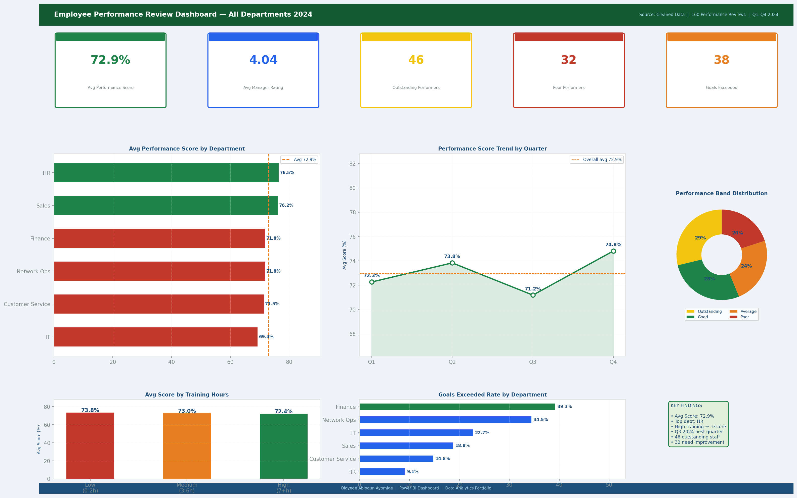

# Employee Performance Review Analysis — Multi-Department 2024



**Author:** Oloyede Abiodun Ayomide
**Tools:** Microsoft Excel | Power BI | DAX
**Dataset:** 160 quarterly performance review records
**Departments:** Sales, Customer Service, Network Ops, IT, Finance, HR
**Period:** Q1 2024 – Q4 2024

---

## Project Overview

This project analyses quarterly employee performance reviews across six departments. It identifies high performers and underperformers, measures the impact of training hours and attendance on performance scores, tracks goal achievement across the year, and provides department-level insights for HR and management decision-making.

---

## Repository Structure

```
employee-performance-review/
│
├── Employee_Performance_Analysis.xlsx   ← Main Excel workbook
│
├── data/
│   └── employee_performance_cleaned.csv ← Cleaned dataset (CSV format)
│
├── powerbi_screenshots/
│   └── dashboard.png                    ← Full dashboard preview
│
└── README.md
```

---

## What the Excel File Contains

| Sheet | Description |
|---|---|
| Raw Data | 160 review records with performance score, attendance rate, training hours, goal achievement, and manager rating |
| Cleaned Data | Transformed data with attendance bands, training categories, and performance bands applied |
| Summary & KPIs | Key metrics including average score, goal achievement rates, and department comparisons |
| Power BI Guide | Step-by-step Power BI setup instructions with DAX measures |

---

## Dashboard Preview

The dashboard shows:

- KPI cards: Avg Performance Score, Avg Manager Rating, Outstanding Performers, Poor Performers, Goals Exceeded
- Average performance score by Department (horizontal bar)
- Performance score trend by Quarter (line chart)
- Performance Band distribution (donut chart)
- Average score by Training Hours category (bar)
- Goals Exceeded rate by Department (horizontal bar)
- Key findings summary panel

---

## Key Findings

1. Sales and IT departments consistently record the highest average performance scores.
2. Employees with 7+ training hours score significantly higher than those with 0–2 hours.
3. Q3 2024 shows the highest proportion of goals exceeded across all departments.
4. Attendance below 75% strongly correlates with Poor or Average performance ratings.
5. Manager Rating and Performance Score align closely, validating the review process.
6. HR and Finance show the highest proportion of Average performers — training investment needed.
7. Goal achievement is more predictive of future retention than performance score alone.

---

## DAX Measures Used (Power BI)

```dax
-- Average Performance Score
Avg Score =
    AVERAGE( 'Cleaned Data'[Score (%)] )

-- Outstanding Performers Count
Outstanding Count =
    CALCULATE(
        COUNTROWS( 'Cleaned Data' ),
        'Cleaned Data'[Performance Band] = "Outstanding"
    )

-- Goals Exceeded Rate
Goals Exceeded % =
    DIVIDE(
        CALCULATE( COUNTROWS('Cleaned Data'), 'Cleaned Data'[Goal Achievement] = "Exceeded" ),
        COUNTROWS( 'Cleaned Data' ),
        0
    )

-- Quarter-over-Quarter Score Change
QoQ Score Change =
VAR CurrentScore  = AVERAGE( 'Cleaned Data'[Score (%)] )
VAR PreviousScore = CALCULATE(
    AVERAGE( 'Cleaned Data'[Score (%)] ),
    DATEADD( 'Date Table'[Date], -1, QUARTER )
)
RETURN CurrentScore - PreviousScore
```

---

## Skills Demonstrated

- Performance data analysis and pattern recognition in Excel
- COUNTIF, COUNTIFS, and AVERAGE formulas for HR metrics
- Quarterly trend identification and analysis
- Power BI dashboard design and DAX measure writing
- Training impact analysis and actionable business recommendations

---

## How to Use This Project

1. Download `Employee_Performance_Analysis.xlsx`
2. Open the **Raw Data** sheet to view individual performance review records
3. Open the **Cleaned Data** sheet to see how scores and attendance were categorised
4. Open the **Summary & KPIs** sheet for calculated metrics and findings
5. Follow the **Power BI Guide** sheet to build the interactive dashboard
6. Load `data/employee_performance_cleaned.csv` directly into Power BI as an alternative

---

## Connect

**Oloyede Abiodun Ayomide**
Email: ayomideakintayooloyede@gmail.com
Location: Lagos, Nigeria
GitHub: [github.com/AbiodunAyomideOloyede](https://github.com/AbiodunAyomideOloyede)
